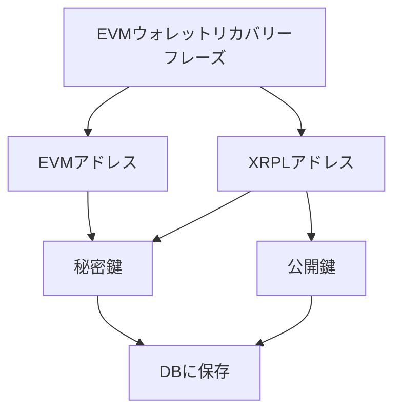

## 実装機能

- [x] Ethereumでログイン
- [x] XRP残高の表示
- [x] EVMウォレットとXRPLウォレットの紐付け
  - DBはSupabase
  - EVMのニーモニックを使ってXRPLウォレットを一意に導いている
    - 秘密鍵の取り回しは全てフロンテエンド・クライアント側で完結している
- [x] EVMウォレットアドレスによるXRPLウォレットアドレスの検索
- [x] XRPLウォレットアドレスによるEVMウォレットアドレスの検索
- [x] EVMウォレットアドレスによるXRPLウォレットアドレスへXRPの送金
- [x] EVMチェーン（Sepolia, Mumbai）上のトークン残高表示

## UX

### データ構造



## 開発
```bash
pnpm install
prisma migrate dev --name init
prisma generate
pnpm dev
```