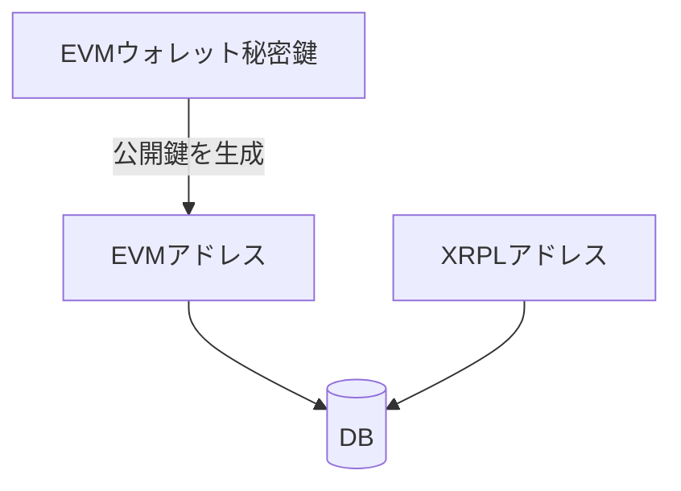
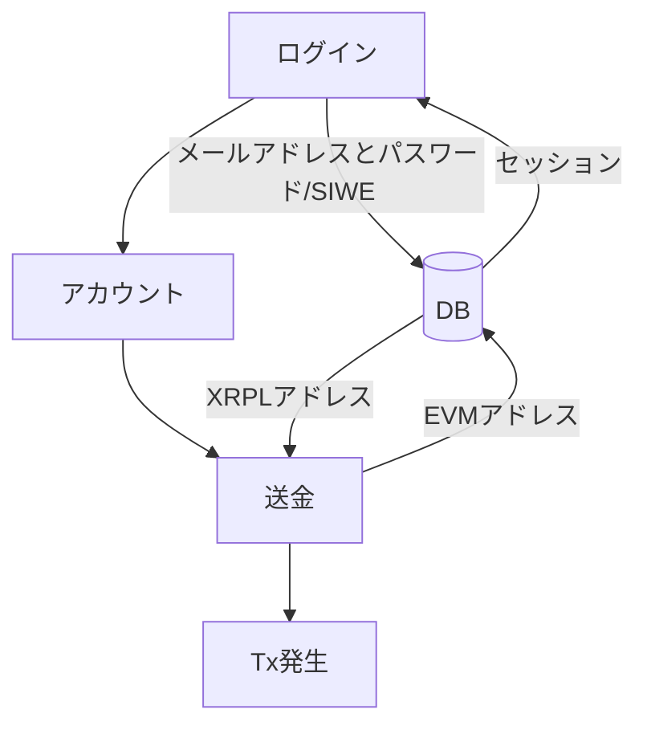

## 実装機能
- [x] Ethereumでログイン
- [x] XRP残高の表示
- [x] EVMウォレットとXRPLウォレットの紐付け
    - DBはSupabase
    - EVMのニーモニックを使ってXRPLウォレットを一意に導いている
        - 秘密鍵の取り回しは全てフロンテエンド・クライアント側で完結している
- [x] EVMウォレットアドレスによるXRPLウォレットアドレスの検索
- [ ] XRPLウォレットアドレスによるEVMウォレットアドレスの検索
- [ ] EVMウォレットアドレスによるXRPLウォレットアドレスへXRPの送金
- [ ] EVMチェーン（Sepolia, Mumbai）上のトークン残高表示

## UX

### データ構造

### ウォレットアプリ
