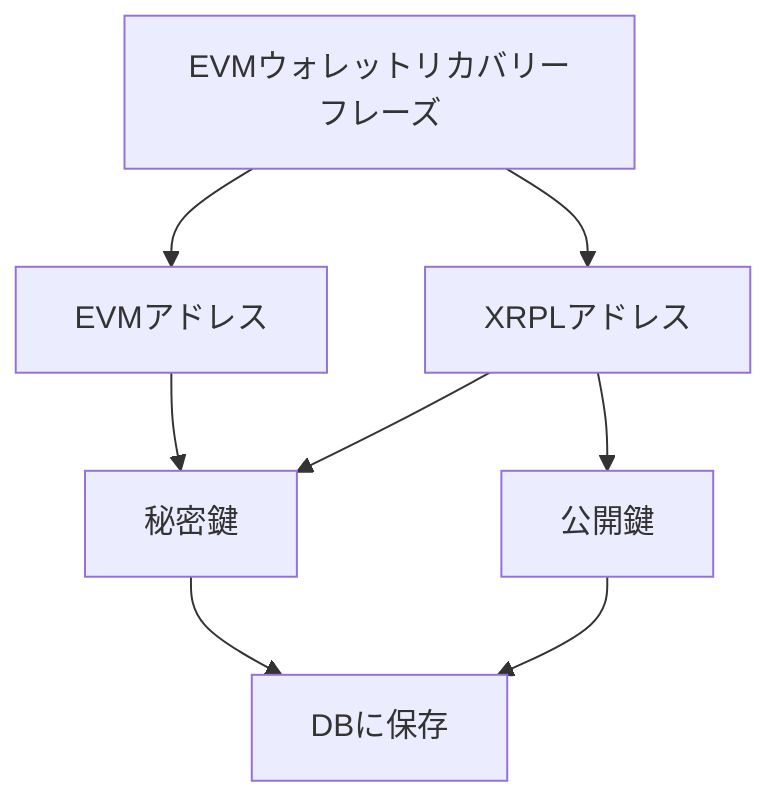

## 実装機能

### SIWE
- [x] Ethereumでログイン

### トークン残高表示
- [x] XRP残高の表示
- [x] EVMチェーン（Sepolia）上のETH残高表示

### EVMウォレットとXRPLウォレットの一元管理
- [x] EVMウォレットとXRPLウォレットの紐付け
  - DBはPrisma
  - EVMのニーモニックを使ってXRPLウォレットを一意に導いている
- [x] EVMウォレットアドレスによるXRPLウォレットアドレスの検索
- [x] XRPLウォレットアドレスによるEVMウォレットアドレスの検索

### 独立したトランザクションの発生
- [x] 外部ウォレット無しでXRPLウォレットアドレスへXRPの送金
- [x] 外部ウォレット無しでEVMウォレットアドレスへETHの送金

## UX

### データ構造



## 開発
```bash
pnpm install
prisma migrate dev --name init
prisma generate
pnpm dev
```

## 注意点
- SQLiteを用いてローカルでDBを立てているため、Vercelでは動作しません
- ただし、外部でホストしたDBをPrismaに接続すれば、Vercelでも動くはずです
- 秘密鍵と公開鍵はDBに直で保存しているため、外部に公開されたマシンでは動かさないでください
- DBとの通信部分は全てAPI Routesに切り出しているので、これを丸ごとAWS Lambdaに移植してAPI Gatewayを掛ければ最低限のセキュリティは確保できるでしょう
- ウォレットの生成にはMetaMaskの使用を推奨します
- なお、MetaMaskは一つのmnemonicから複数のウォレットを導いていますが、今回のプロジェクトファイルが全て漏洩したとしても他のウォレットの情報が漏れることはありません DBには秘密鍵と公開鍵しか保存していないためです