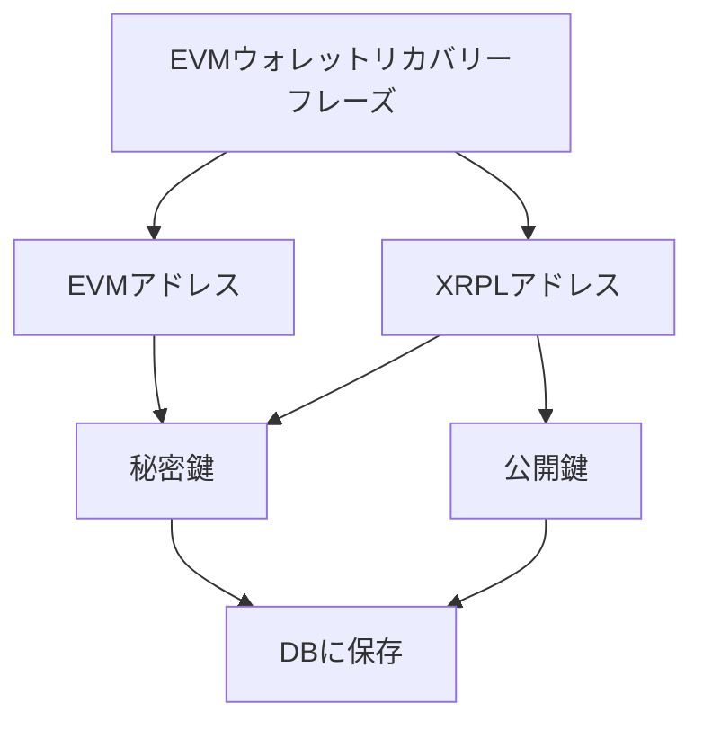

## 実装機能

- [x] Ethereumでログイン

- [x] XRP残高の表示
- [x] EVMチェーン（Sepolia）上のETH残高表示

- [x] EVMウォレットとXRPLウォレットの紐付け
  - DBはPrisma
  - EVMのニーモニックを使ってXRPLウォレットを一意に導いている
- [x] EVMウォレットアドレスによるXRPLウォレットアドレスの検索
- [x] XRPLウォレットアドレスによるEVMウォレットアドレスの検索

- [x] 外部ウォレット無しでXRPLウォレットアドレスへXRPの送金
- [x] 外部ウォレット無しでEVMウォレットアドレスへETHの送金

## UX

### データ構造



## 開発
```bash
pnpm install
prisma migrate dev --name init
prisma generate
pnpm dev
```