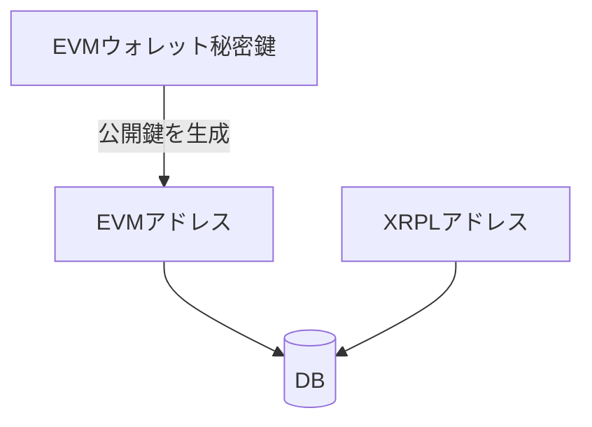
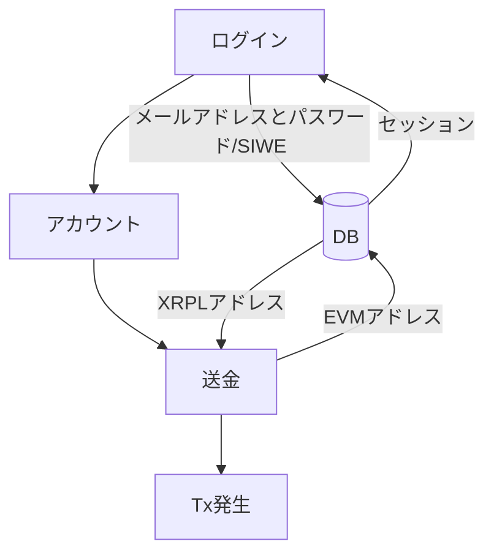

## UX

### データ構造

```mermaid
graph TB
    A[EVMウォレット秘密鍵] --> |公開鍵を生成|B[EVMアドレス]
    B --> D[(DB)]
    C[XRPLアドレス] --> D
```

### ウォレットアプリ

```mermaid
graph TB
    A --> |メールアドレスとパスワード/SIWE|C
    C --> |セッション|A
    A[ログイン] --> D[アカウント]
    D --> B[送金]
    B --> |EVMアドレス|C[(DB)]
    C --> |XRPLアドレス|B
    B --> E[Tx発生]
```